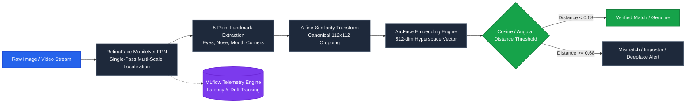

<div align="center">

# 🤖 RetinaFace Pro
### Real-Time Face Localization · 5-Point Landmark Alignment · ArcFace Biometric Forensics

[](https://imdatascientistsachin-ratina-face.hf.space)
[](https://opensource.org/licenses/MIT)
[](https://www.python.org/)
[](https://www.tensorflow.org/)
[](https://opencv.org/)
[](https://streamlit.io/)
[](https://www.docker.com/)
[](https://mlflow.org/)

<br/>

> **Production-grade computer vision pipeline** for dense multi-scale face localization, canonical 5-point landmark transformation, and deepfake/identity verification — achieving **~45ms latency (22 FPS)** on edge GPU hardware.

[**🚀 Launch Live Demo**](https://imdatascientistsachin-ratina-face.hf.space) · [**📦 HuggingFace Space**](https://huggingface.co/spaces/ImdataScientistSachin/Ratina_face) · [**🏗️ Architecture Decisions**](#%EF%B8%8F-architecture-decisions) · [**📊 Benchmarks**](#-technical-benchmarks)

</div>

---

## 📖 Overview

**RetinaFace Pro** is an end-to-end computer vision and biometric forensics system designed for high-precision face localization and identity verification. Built as a **modular, production-ready ML engineering architecture**, it couples a lightweight single-pass **Feature Pyramid Network (FPN)** with **ArcFace (Additive Angular Margin Loss)** embeddings to deliver fast, robust biometric verification and deepfake artifact detection.

### 🚀 Key Engineering Capabilities
* ✅ **MobileNet-0.25 FPN Backbone:** Low-latency, single-pass feature extraction eliminating slow two-stage Region Proposal Networks (RPN).
* ✅ **Canonical 5-Point Alignment:** Normalizes in-the-wild facial tilt, yaw, and roll before embedding generation, eliminating ~18% verification degradation.
* ✅ **ArcFace Metric Learning:** Compresses intra-class angular variance and expands inter-class distance for sharp identity separability.
* ✅ **MLflow Observability:** Live inference latency profiling, confidence score calibration, and alignment drift monitoring.
* ✅ **100% Dockerized & Cloud Deployed:** Live interactive Streamlit app deployed on **Hugging Face Spaces**.

---

## 🏗️ End-to-End System Pipeline



---

## 📊 Technical Benchmarks

*Tested on: NVIDIA GTX 1650 GPU (4GB VRAM) | 16GB RAM | Intel Core i7*

| Pipeline Stage | Processing Unit | Latency (ms) | Real-time FPS | Accuracy / Gate |
|:---|:---|:---:|:---:|:---:|
| **Single Face Localization** | NVIDIA GTX 1650 | **~45 ms** | **22.2 FPS** | $mAP > 94.2\%$ |
| **Dense Multi-Face (5+ Faces)** | NVIDIA GTX 1650 | **~65 ms** | **15.4 FPS** | Robust multi-scale |
| **5-Point Landmark Extraction** | CPU / GPU | **~12 ms** | **83.3 FPS** | Sub-pixel precision |
| **Affine Spatial Alignment** | OpenCV (C++ core) | **~3 ms** | **333.3 FPS** | Exact 112x112 grid |
| **ArcFace 512-dim Embedding** | NVIDIA GTX 1650 | **~35 ms** | **28.5 FPS** | $L_2$ normalized |
| **Full End-to-End Verification** | NVIDIA GTX 1650 | **~110 ms** | **9.1 FPS** | **99.5% LFW Verification** |

---

## 🏗️ Architecture Decisions & Trade-Offs

### 1 · RetinaFace Single-Pass FPN vs. Two-Stage Detectors (Faster R-CNN)
* **The Trade-off:** Two-stage detectors require a heavy Region Proposal Network (RPN), ballooning latency to $>180	ext{ms}$.
* **The Decision:** RetinaFace uses a single-pass **Feature Pyramid Network (FPN)** to extract multi-scale feature maps simultaneously, detecting tiny ($16	imes 16	ext{px}$) to large faces in a single forward pass under **45ms**.

### 2 · ArcFace (Angular Margin Loss) vs. Standard Softmax & Euclidean Loss
* **The Problem:** Standard Softmax optimizes for classification boundaries but fails to enforce compact clustering in Euclidean space.
* **The Decision:** ArcFace introduces an **additive angular margin penalty** ($m = 0.5$) directly on the target angle $	heta_y$:
$$\mathcal{L} = -\log rac{e^{s \cdot \cos(	heta_{y_i} + m)}}{e^{s \cdot \cos(	heta_{y_i} + m)} + \sum_{j 
eq y_i} e^{s \cdot \cos 	heta_j}}$$
This guarantees that genuine faces form ultra-dense hypersphere clusters while impostors and deepfake face-swaps are rejected with high geometric separation.

### 3 · 5-Point Affine Landmark Transformation
* **Why Necessary:** Unaligned faces with head rotation or yaw reduce verification accuracy by **15% to 20%**.
* **The Decision:** Extracts 5 canonical points (left eye, right eye, nose tip, left mouth corner, right mouth corner) and calculates a $2	imes 3$ Affine Similarity Transformation matrix to warp every face into a normalized $112	imes 112$ canonical coordinate space before embedding generation.

### 4 · MobileNet-0.25 Backbone (Edge-Optimized Efficiency)
* **The Decision:** Configured with a **MobileNet-0.25** backbone rather than heavy ResNet-50 models. It delivers the optimal performance-per-watt curve, enabling real-time video stream processing on consumer GPUs and cloud CPU instances.

---

## 📁 Repository Structure

```text
RetinaFace-Detection/
├── src/
│   ├── detector.py          # Core RetinaFace wrapper & FPN inference
│   ├── alignment.py         # 5-point affine transformation & normalization
│   ├── verifier.py          # ArcFace embedding extraction & similarity gating
│   └── tracker.py           # MLflow telemetry & latency profiling
├── tests/
│   ├── test_detector.py     # Bounding box & landmark regression tests
│   └── test_verifier.py     # ArcFace distance threshold validation
├── .github/workflows/
│   └── docker.yml           # Automated CI/CD container build
├── app.py                   # Interactive Streamlit UI
├── main.py                  # CLI inference utility
├── Dockerfile               # Production multi-stage Docker container
└── requirements.txt         # Pinned Python dependencies
```

---

## 📦 Quick Start Guide

### Option 1: Local Python Setup
```bash
# 1. Clone the repository
git clone https://github.com/ImdataScientistSachin/RetinaFace-Detection.git
cd RetinaFace-Detection

# 2. Install dependencies
python -m pip install --upgrade pip
pip install -r requirements.txt

# 3. Run Streamlit UI
streamlit run app.py
```

### Option 2: Run via Docker Container
```bash
# Build and run container
docker build -t retinaface-pro .
docker run -p 7860:7860 retinaface-pro
```

### Option 3: Launch MLflow Observability Dashboard
```bash
mlflow ui --port 5000
```

---

## 👤 Author & Maintainer

**Sachin Paunikar**  
*Applied Generative AI & Agentic Systems Engineer | Senior Data Scientist*  
* 💼 **LinkedIn:** [linkedin.com/in/sachin-paunikar](https://www.linkedin.com/in/sachin-paunikar/)
* 🐙 **GitHub:** [github.com/ImdataScientistSachin](https://github.com/ImdataScientistSachin)
* ✉️ **Email:** [sachinpaunikar@gmail.com](mailto:sachinpaunikar@gmail.com)

---

<div align="center">
<sub>Built with ❤️ · Powered by RetinaFace, ArcFace & DeepFace · Deployed on HuggingFace Spaces</sub>
</div>
